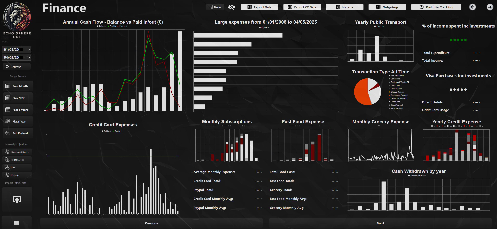

# PyQt6 Financial KPI Dashboard

> Real-time financial metrics dashboard with data importing and multi metric visualization.

[](https://www.python.org/)
[](https://www.riverbankcomputing.com/software/pyqt/)
[](https://github.com/Naadir Dev Portfolio/Desktop PyQt6-finance dashboard)

---

## Overview

The PyQt6 Financial KPI Dashboard is a professional desktop application designed for financial professionals and analysts who need to monitor key performance indicators in real-time. Built with PyQt6, this dashboard provides an intuitive interface for importing financial data, visualizing metrics, and analyzing trends.

The application features a responsive dark themed UI with date range filtering capabilities, allowing users to slice and filter financial data dynamically. It supports multiple data sources and KPI visualizations, making it ideal for financial planning, analysis, and reporting workflows.

---

## Features

- Import financial data from multiple sources
- Real-time KPI calculations and monitoring
- Date range filtering and data slicing
- Professional dark themed UI
- Multi metric visualization
- Responsive layout for various screen sizes
- Professional styling with consistent branding
- Data export capabilities

---

## Screenshots

> Drop screenshots into `screens/` and reference them below.



---

## Getting Started

### Prerequisites

- Python 3.8 or higher
- PyQt6
- Pandas (for data handling)

### Installation

```bash
git clone https://github.com/Naadir-Dev-Portfolio/Desktop-PyQt6-finance-dashboard.git
cd Desktop-PyQt6-finance-dashboard
pip install -r requirements.txt
```

### Run

```bash
python Ui_finance.py
```

---

## Tech Stack

- PyQt6, Modern desktop UI framework
- Pandas, Data manipulation and analysis
- Python, Core application logic

---

## Related Projects

- [Desktop Mortgage overpayment tracker](https://github.com/Naadir Dev Portfolio/Desktop Mortgage overpayment tracker)
- [Desktop PyQt6-health dashboard](https://github.com/Naadir Dev Portfolio/Desktop PyQt6-health dashboard)
- [Desktop youtube view stats dashboard](https://github.com/Naadir Dev Portfolio/Desktop youtube view stats dashboard)
